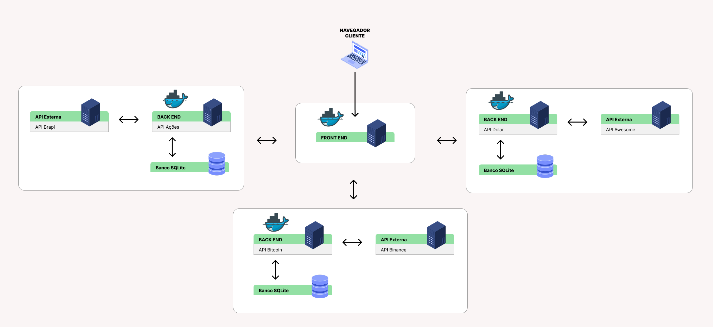

# Sistema de Gestão Financeira :money_with_wings:

  
*Arquitetura do sistema: Frontend + Microsserviços*

Sistema modular para gestão de investimentos em ações, dólar, bitcoin e renda fixa, com dashboard interativo e integração em tempo real com APIs financeiras.

## :rocket: **Como Executar (Docker Compose)**

1. **Pré-requisitos**:
   - Docker e Docker Compose instalados 

2. **Clone o repositório**:
   ```bash
   git clone [URL_DO_REPOSITÓRIO]
   cd nome-do-repositorio

3. **Execute todos os serviços**:
   docker-compose up --build